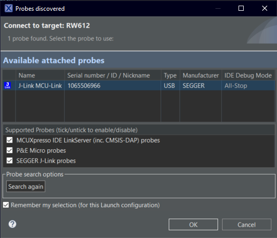

# NXP Application Code Hub
[](https://www.nxp.com)

## Migration from FRDM-RW612 to third-party module memories

The objective of this application note is to help developers migrate their applications from the FRDM-RW612 board to a module-based board.

The application note provides:
<ul><li>An overview of what does imply to move your application to a different board with different Flash and pSRAM.</li>
<li>A list of flash configuration files (flash_config.c) for each supported module.</li>
<li>A list of application flash and pSRAM configurations for each supported module.</li>
<li>A comparison of PIN configurations between the FRDM-RW612 board and the modules.</li></ul>

The RW612 MCU subsystem includes a 260 MHz Arm® Cortex®-M33 core with TrustZone™-M, 1.2 MB on-chip SRAM. The RW612 subsystem also includes a quad SPI interface with high bandwidth and an on-the-fly decryption engine to securely access the off-chip XIP flash and the pSRAM.

FRDM-RW612 is a compact and a scalable development board for rapid prototyping of RW61x wireless MCUs. FRDM-RW612 offers industry-standard headers for easy access to the input and output port of the MCU, integrated open-standard serial interfaces, external flash memory, and an onboard MCU-Link debugger.

<center>


</center>

Developing a wireless enabled board is challenging, as it requires in-house wireless design expertise along with expensive equipment. Several module manufacturers offer off-the-shelf modules based on the RW61x SoC family. These modules come with the RW61x SoC along with XIP NOR flash, pSRAM, and the Wireless frontend ready for companies to use in connected products. Some module manufacturers provide some pre-certifications, which are used when certifying the final product.
Using off-the-shelf wireless modules based on the RW61x streamlines the product development cycle, allowing OEM companies to focus on delivering high value-connected applications to their customers.

Firmware developers working on connected products can start their applications in the FRDM-RW612 board and at some point in the development process, migrate their projects to a custom board based on a module.

This document outlines the changes required to migrate an application from the FRDM-RW612 board to a module-based board. 

* [Chapter 1](#step1) lists the different components affected by the migration. For example, memories, I/O, clock, and power. This chapter also provides insights on the required changes for the new module-based board.
* [Chapter 2](#step2) lists some of the modules based on the RW61x SoCs. The chapter also provides a comparison of the pin configurations between the FRDM-RW612 and the different modules.
* Also, in [Chapter 3](#step3) provides the source code with memory configurations for the modules. 
* [Chapter 4](#step4) lists the instructions to use the companion software.


The following is the list of modules based on the RW612 SoC covered in this application note:

<dl>
<dt>Ublox</dt>
  <dd>IRIS-W106-00B</dd>
  <dd>IRIS-W106-10B</dd>
  <dd>IRIS-W106-30B</dd>
  <dd>IRIS-W101-00B</dd>
  <dd>IRIS-W101-10B</dd>
  <dd>IRIS-W101-30B</dd>
<dt>AzureWave</dt>
  <dd>AW-CU598</dd>
  <dd>AW-CU570</dd>
<dt>Murata</dt>
  <dd>Type 2FR </dd>
</dl>

#### Boards: FRDM-RW612
#### Categories: Memory
#### Peripherals: FLASH
#### Toolchains: MCUXpresso IDE

## Table of Contents
1. [Migration process overview](#step1)
   1. [Memories](#step1.1)
   2. [I/O (GPIO, UART, I2C, I2S, SPI, and so on)](#step1.2)
   3. [Clocking options](#step1.3)
   4. [Power](#step1.4)
2. [Migrating to specific modules](#step2)
   1. [u-Blox IRIS-W10](#step2.1)
   2. [AzureWave](#step2.2)
   9. [Murata Type 2FR ](#step2.9)
3. [Software](#step3)
4. [Setup](#step4)
5. [Results](#step5)
6. [Support](#step6)
7. [Release Notes](#step7)

## 1. Migration process overview<a name="step1"></a>
When migrating from FRDM-RW612 to a custom board, there are a few things to consider for your application to work in the new hardware:
* The memory configuration, including ports assignments, operation voltage, and speed.
* Other I/O, such as GPIO, UART, I2C, I2S, SPI, and so on, required by your application.

### 1.1 Memories<a name="step1.1"></a>
Modules can have different memories from the ones on the FRDM-RW612 board. The FRDM-RW612 comes built-in with a W25Q512JVFIQ NOR flash connected to the FlexSPI port A1 and a APS6404L pSRAM connected to the port B1.

<center>


</center>
<center>


</center>
<center>

|Model|Technology|Port|Capacity|Voltage|Clock frequency|
|:-:|:-:|:-:|:-:|:-:|:-:|
|W25Q512JVFIQ|Nor Flash|FlexSPI A1|512 Mbit|2.7 V ~ 3.6 V|133 MHz|
|APS6404L-3SQN-SN|PSRAM|FlexSPI B1|64 Mbit|2.7 V ~ 3.6 V|133 MHz|

</center>

The RW61x devices provide a high-speed SPI interface named FlexSPI. It is supported by two cache memories and provides two SPI channels for up to two external devices. Each channel supports Single/Dual/Quad mode data transfers (1/2/4 bidirectional data lines).

The RW612 supports memories that are JESD216 compliant. The FlexSPI interface is explained in detail in the UM11865 RW61x User Manual (Chapter 12). The registers are listed in the RM00278 RW61x Registers Reference Manual (Chapter 43). Refer to UM11865 before selecting a memory device to ensure that it can be connected to RW612.

#### NOR Flash

First, the external NOR flash memory configuration must be updated so that the code stored in it can be executed on the new board. The initial flash configuration is performed by the ROM bootloader.

The flash configuration is located in all the MCUXpresso SDK example projects in [flash_config.c](frdmrw612_module_migration_example/flash_config/flash_config_W25Q512JVFIQ.c) in the _flexspi_config_ structure. This structure defines the content of the Flash Configuration Block (FCB) used by the ROM bootloader to configure the FlexSPI controller to access the NOR flash.

The following is an example of what you would find in an SDK flash configuration.

```c
const fc_flexspi_nor_config_t flexspi_config = {
    .memConfig =
        {
            .tag                 = FC_BLOCK_TAG,
            .version             = FC_BLOCK_VERSION,
            .readSampleClkSrc    = 1,
            .csHoldTime          = 3,
            .csSetupTime         = 3,
            .deviceModeCfgEnable = 1,
            .deviceModeSeq       = {.seqNum = 1, .seqId = 2},
            .deviceModeArg       = 0x02,
            .configCmdEnable     = 0,
            .deviceType          = 0x1,
            .sflashPadType       = kSerialFlash_4Pads,
            .serialClkFreq       = 5,
            .sflashA1Size        = 0x4000000U,
            .sflashA2Size        = 0,
            .sflashB1Size        = 0,
            .sflashB2Size        = 0,
            .lookupTable =
                {
                    /* Read */
                    [0] = FC_FLEXSPI_LUT_SEQ(FC_CMD_SDR, FC_FLEXSPI_1PAD, 0xEC, FC_RADDR_SDR, FC_FLEXSPI_4PAD, 0x20),
                    [1] = FC_FLEXSPI_LUT_SEQ(FC_MODE8_SDR, FC_FLEXSPI_4PAD, 0xF0, FC_DUMMY_SDR, FC_FLEXSPI_4PAD, 0x04),
                    [2] = FC_FLEXSPI_LUT_SEQ(FC_READ_SDR, FC_FLEXSPI_4PAD, 0x04, FC_STOP_EXE, FC_FLEXSPI_1PAD, 0x00),

                    /* Read Status */
                    [4 * 1 + 0] =
                        FC_FLEXSPI_LUT_SEQ(FC_CMD_SDR, FC_FLEXSPI_1PAD, 0x05, FC_READ_SDR, FC_FLEXSPI_1PAD, 0x04),

                    /* Write Status */
                    [4 * 2 + 0] =
                        FC_FLEXSPI_LUT_SEQ(FC_CMD_SDR, FC_FLEXSPI_1PAD, 0x31, FC_WRITE_SDR, FC_FLEXSPI_1PAD, 0x01),

                    /* Write Enable */
                    [4 * 3 + 0] =
                        FC_FLEXSPI_LUT_SEQ(FC_CMD_SDR, FC_FLEXSPI_1PAD, 0x06, FC_STOP_EXE, FC_FLEXSPI_1PAD, 0x00),

                    /* Sector erase */
                    [4 * 5 + 0] =
                        FC_FLEXSPI_LUT_SEQ(FC_CMD_SDR, FC_FLEXSPI_1PAD, 0x21, FC_RADDR_SDR, FC_FLEXSPI_1PAD, 0x20),

                    /* Block erase */
                    [4 * 8 + 0] =
                        FC_FLEXSPI_LUT_SEQ(FC_CMD_SDR, FC_FLEXSPI_1PAD, 0xDC, FC_RADDR_SDR, FC_FLEXSPI_1PAD, 0x20),

                    /* Page program */
                    [4 * 9 + 0] =
                        FC_FLEXSPI_LUT_SEQ(FC_CMD_SDR, FC_FLEXSPI_1PAD, 0x34, FC_RADDR_SDR, FC_FLEXSPI_1PAD, 0x20),
                    [4 * 9 + 1] =
                        FC_FLEXSPI_LUT_SEQ(FC_WRITE_SDR, FC_FLEXSPI_4PAD, 0x00, FC_STOP_EXE, FC_FLEXSPI_1PAD, 0x00),

                    /* chip erase */
                    [4 * 11 + 0] =
                        FC_FLEXSPI_LUT_SEQ(FC_CMD_SDR, FC_FLEXSPI_1PAD, 0xC7, FC_STOP_EXE, FC_FLEXSPI_1PAD, 0x00),
                },
        },
    .pageSize           = 0x100,
    .sectorSize         = 0x1000,
    .ipcmdSerialClkFreq = 0,
    .blockSize          = 0x10000,
    .fcb_fill[0]        = 0xFFFFFFFF,
};

```

The default content of _flexspi_config_ is based on the FRDM-RW612 W25Q512JVFIQ NOR flash. This content of the structure must be changed to match with the parameters and commands of the flash device of the new board.

For more information on the FCB, see the _UM11865 RW61x User Manual (Chapter 7.3.1.1.3 Configuration of the boot ROM Flash driver during boot)_. _AN13869 RW61x Flashloader for Custom Flash Devices_, also provides guidance on how to set up a new flash device to be used with the RW61x.

In some projects, which use LittleFS, a special NOR Flash configuration is applied to FlexSPI in the mflash driver. This configuration is located in [mflash_drv.c](frdmrw612_module_migration_example/flash/mflash/frdmrw612/mflash_drv_W25Q512JVFIQ.c) and [mflash_drv.h](frdmrw612_module_migration_example/flash/mflash/frdmrw612/mflash_drv.h). Those files also must be updated for LittleFS to work with the new NOR flash.

The next chapter provides the FCB structures filled with the configuration for the flash memories populated on some of the available modules with the RW612.

#### pSRAM

The pSRAM configuration is located in [board.c](frdmrw612_module_migration_example/board/board.c), specifically into _BOARD_InitPsRam()_. The default content of the _psramConfig_ structure has the configuration for the APS6404L pSRAM. This structure must be updated to match with the memory configuration of the new board.

```c
flexspi_device_config_t psramConfig = {
        .flexspiRootClk       = 106666667, /* 106MHZ SPI serial clock */
        .isSck2Enabled        = false,
        .flashSize            = 0x2000,    /* 64Mb/KByte */
        .addressShift         = false,
        .CSIntervalUnit       = kFLEXSPI_CsIntervalUnit1SckCycle,
        .CSInterval           = 0,
        .CSHoldTime           = 3,
        .CSSetupTime          = 3,
        .dataValidTime        = 1,
        .columnspace          = 0,
        .enableWordAddress    = false,
        .AWRSeqIndex          = 12,
        .AWRSeqNumber         = 1,
        .ARDSeqIndex          = 11,
        .ARDSeqNumber         = 1,
        .AHBWriteWaitUnit     = kFLEXSPI_AhbWriteWaitUnit2AhbCycle,
        .AHBWriteWaitInterval = 0,
        .enableWriteMask      = true,
    };

    uint32_t psramLUT[16] = {
        /* Read Data */
        [0] = FLEXSPI_LUT_SEQ(kFLEXSPI_Command_SDR, kFLEXSPI_1PAD, 0xEB, kFLEXSPI_Command_RADDR_SDR, kFLEXSPI_4PAD, 24),
        [1] = FLEXSPI_LUT_SEQ(kFLEXSPI_Command_DUMMY_SDR, kFLEXSPI_4PAD, 6, kFLEXSPI_Command_READ_SDR, kFLEXSPI_4PAD,
                              0x04),

        /* Write Data */
        [4] = FLEXSPI_LUT_SEQ(kFLEXSPI_Command_SDR, kFLEXSPI_1PAD, 0x38, kFLEXSPI_Command_RADDR_SDR, kFLEXSPI_4PAD, 24),
        [5] = FLEXSPI_LUT_SEQ(kFLEXSPI_Command_WRITE_SDR, kFLEXSPI_4PAD, 0x00, kFLEXSPI_Command_STOP, kFLEXSPI_1PAD, 0x00),

        /* Reset Enable */
        [8] = FLEXSPI_LUT_SEQ(kFLEXSPI_Command_SDR, kFLEXSPI_1PAD, 0x66, kFLEXSPI_Command_STOP, kFLEXSPI_1PAD, 0x00),

        /* Reset */
        [12] = FLEXSPI_LUT_SEQ(kFLEXSPI_Command_SDR, kFLEXSPI_1PAD, 0x99, kFLEXSPI_Command_STOP, kFLEXSPI_1PAD, 0x00),
    };

```

The next chapter provide _psramConfig_ structures filled with the configurations for the pSRAM memories populated on some of the available modules with RW612.

### 1.2 I/O (GPIO, UART, I2C, I2S, SPI, and so on)<a name="step1.2"></a>

All the projects based on the FRDM-RW612 SDK examples have some board-specific configurations for peripherals such as UART, I2C, USIM, and so on. Also, some board components such as switches and LEDs have configurations in the project.

The configurations are available in [board.c](frdmrw612_module_migration_example/board/board.c), [board.h](frdmrw612_module_migration_example/board/board.h), [pin_mux.c, and](frdmrw612_module_migration_example/board/pin_mux.c) [pin_mux.h](frdmrw612_module_migration_example/board/pin_mux.h).

#### board.c and board.h

The board.c and board.h files include macros and functions to select and configure some of the board peripherals. For example, the UART used by the debug console, which is used for _PRINTF()_.

```c
/*! @brief The UART to use for debug messages. */
#define BOARD_DEBUG_UART_TYPE     kSerialPort_Uart
#define BOARD_DEBUG_UART_BASEADDR (uint32_t) FLEXCOMM3
#define BOARD_DEBUG_UART_INSTANCE 3U
#define BOARD_DEBUG_UART          USART3
#define BOARD_DEBUG_UART_CLK_FREQ CLOCK_GetFlexCommClkFreq(3)
#define BOARD_DEBUG_UART_FRG_CLK \
    (&(const clock_frg_clk_config_t){3, kCLOCK_FrgPllDiv, 255, 0}) /*!< Select FRG3 mux as frg_pll */
#define BOARD_DEBUG_UART_CLK_ATTACH kFRG_to_FLEXCOMM3
#define BOARD_DEBUG_UART_RST        kFC3_RST_SHIFT_RSTn
#define BOARD_DEBUG_UART_CLKSRC     kCLOCK_Flexcomm3
#define BOARD_UART_IRQ_HANDLER      FLEXCOMM3_IRQHandler
#define BOARD_UART_IRQ              FLEXCOMM3_IRQn

#ifndef BOARD_DEBUG_UART_BAUDRATE
#define BOARD_DEBUG_UART_BAUDRATE 115200
#endif /* BOARD_DEBUG_UART_BAUDRATE */
```

If your board has a different FlexComm UART port for the debug console, then you can change it here, along with other parameters such as the clock configurations and the baud rate.

#### pin_mux.c and pin_mux.h

The pin_mux.c and pin_mux.h files provide functions that configure the pins used by the application.
```c
void BOARD_InitPins(void)
{
    /* Initialize FC3_USART_DATA functionality on pin GPIO_24 (pin F3) */
    IO_MUX_SetPinMux(IO_MUX_FC3_USART_DATA);
}
```

Modify the functions to select and map the functionality to your board pins.

[Chapter 2](#step2) lists some comparisons between the pins on the FRDM-RW612 board and the pins on the off-the-shelf modules.

### 1.3 Clocking options<a name="step1.3"></a>

The FRDM-RW612 uses a 40 MHz reference clock for all the clocking network. The modules based on the RW61x family share this feature. Section _2.4.1 Clock generation_, of the _UM11865 RW61x User Manual_, lists all the different options for the Clocking network that feeds all the peripherals and the RW612 core.

An important clock to consider is the FlexSPI clock.
<center>


</center>

The memories of the new board memories may have specific memory clock configurations. Once you know the clock requirements of your board, see the _UM11865 RW61x User Manual, and identify the best clock source and divider for the FlexSPI module to match your required SPI serial clock.

### 1.4 Power<a name="step1.4"></a>

The entire RW61x SoC can be powered using a single 3.3 V external voltage supply with an optional 1.8 V external power supply input to VIO. Depending on the SoC package, there are up to six different power sources for different pins.

VIO_4 and VIO_5 pins can be used to set the I/O voltage level for the different FlexSPI ports. For instance, if your board has a 3.3 V NOR flash memory connected on FlexSPI port A1 then a 3.3 V level must be provided on VIO_4.

The _RW612 Product data sheet_ in sections 7.6.6 and 7.6.7 includes detailed information on which VIO is assigned to each FlexSPI port.

<center>

|Port|VIO|Usage|
|-|-|-|
|FlexSPI Port A1|VIO_4|Nor Flash|
|FlexSPI Port B1|VIO_5|pSRAM or Nand Flash|

</center>

## 2. Migrating to specific modules<a name="step2"></a>
This section includes the basic changes required to move an application from the FRDM-RW612 board to some of the modules that include the RW612 subsystem. It focuses on the changes required for the external memories included on the modules.

### 2.1 u-Blox IRIS-W10<a name="step2.1"></a>
The u-Blox [IRIS-W10](https://www.u-blox.com/en/product/iris-w10-series) series of modules, based on the RW61x SoC, comes with several options for flash memory and antenna capacity. IRIS-W106 comes with an internal PCB antenna to provide a robust low-profile solution with high performance and an extensive range, while IRIS-W101 has a module pin to connect to an external antenna of choice.

These modules only include onboard NOR flash memory but provide the pins to connect an external pSRAM or NAND flash on FlexSPI port B1.

|Module|SoC|Antenna|Flash capacity|
|-|-|-|-|
|IRIS-W101-00B|RW612|External|8 MB|
|IRIS-W101-10B|RW612|External|16 MB|
|IRIS-W101-30B|RW610|External|8 MB|
|IRIS-W106-00B|RW612|Internal|8 MB|
|IRIS-W106-10B|RW612|Internal|16 MB|
|IRIS-W106-30B|RW610|Internal|8 MB|

u-Blox provides _flash_config_ and _flash_drv_ files for their modules on the [**u-Blox-sho-OpenCPU** GitHub repo](https://github.com/u-blox/u-blox-sho-OpenCPU). The files are located in the [MCUXpresso/IRIS-W1/sw_config](https://github.com/u-blox/u-blox-sho-OpenCPU/tree/master/MCUXpresso/IRIS-W1/sw_config) folder.

The following table presents a comparison between the FRDM-RW612 and IRIS-W10 pinouts.

|RW61x signal name|Type|FRDM-RW612 location|IRIS-W10 name|IRIS-W10 description|
|-|-|-|-|-|
|GPIO[0]||RGB LED BLUE/J1-14(ARD_D6_PWM)|FC0-CTS||
|GPIO[1]|I/O|RGB LED RED/J5-1(MIKRO_BUS_PWM)|GPIO1|GPIO|
|GPIO[2]||J5-3(MIKRO_BUS_RX)|FC0-RxD||
|GPIO[3]|O|J5-4(MIKRO_BUS_TX)|FC0-TxD|GPIO|
|GPIO[4]||J1-1(I2S_BCLK)|FC0-SCK||
|GPIO[5]|O|J1-7(MCLK)|FC0-RTS|GPIO|
|GPIO[6]|I|J2-6(ARD_D10_PWM_SPI_CS)|JTAG-TCK|JTAG test reset signal|
|GPIO[7]|I|J2-12(ARD_D13_SPI_CLK)/J6-4(MIKRO_BUS_SPI_CLK)|JTAG-TMS|JTAG test mode select input signal|
|GPIO[8]|I|J1-4(ARD_D1_UART_TX)|JTAG-TDI|JTAG test reset signal|
|GPIO[9]|O|J1-2(ARD_D0_UART_RX)|JTAG-TDO|JTAG test data output signal|
|GPIO[10]|I| J6-4(MIKRO_BUS_CS)|JTAG-nRST|JTAG test reset signal|
|GPIO[11]|I/O|J1-6(ARD_D2)|GPIO11||
|GPIO[12]|I/O|RGB LED GREEN|GPIO12||
|GPIO[13]|I|SWD CLK|FC2-RxD||
|GPIO[14]|O|SWD IO|FC2-TxD||
|GPIO[15]|I|J1-8(ARD_D3_PWM)|SDIO-CLK|SD_CLK SDIO clock input|
|GPIO[16]|I/O|TEMPERATURE SENSOR SDA/J7-8(PMOD_SDA)/J5-6(MIKRO_BUS_SDA)/J2-18(ARD_D18_I2C_SDA)|SDIO-D3|SDIO_DAT3 SDIO data input/output 3|
|GPIO[17]|I/O|TEMPERATURE SENSOR SCL/J7-6(PMOD_SCL)/J5-5(MIKRO_BUS_SCL)/J2-20(ARD_D19_I2C_SCL)|SDIO-CMD|SDIO_CMD SDIO command line|
|GPIO[18]|I/O|J1-10(ARD_D4)/J7-2(PMOD_INT)|SDIO-D2|SDIO_DAT2 SDIO data input/output 2|
|GPIO[19]|I/O| J6-2(MIKRO_BUS_RST)|FC3-RTS|SDIO_DAT0 SDIO data input/output 0|
|GPIO[20]|I/O|J1-16(ARD_D7)|FC3-CTS|SDIO_DAT1 SDIO data input/output 1|
|GPIO[21]|I/O|Ethernet PHY RST|GPIO21|GPIO|
|GPIO[22]|I|Ethernet PHY RX DATA0|RMII-RxD0||
|GPIO[23]|I|Ethernet PHY RX DATA1|RMII-RxD1||
|GPIO[24]|I|MCU-Link UART TX/SW2(MCU WAKEUP)|FC3-RxD||
|GPIO[25]|I/O|Ethernet PHY CLK|RMII-CLK|Ethernet controller reference clock|
|GPIO[26]|O|MCU-Link UART TX|FC3-TxD||
|GPIO[27]|I/O|J1-12(ARD_D5_PWM)|GPIO27|GPIO|
|GPIO[28]|O|QSPI Flash SSL0|||
|GPIO[29]|I/O|TP11|GPIO29||
|GPIO[30]|I/O|QSPI Flash D0|||
|GPIO[31]|I/O|QSPI Flash D1|||
|GPIO[32]|I/O|QSPI Flash D2|||
|GPIO[33]|I/O|QSPI Flash D3|||
|GPIO[34]|O|QSPI Flash CLK0|||
|GPIO[35]|O|QSPI pSRAM CLK0|QSPI-RCLK|QSPI SRAM interface clock0|
|GPIO[36]|O|QSPI pSRAM SSL0|QSPI-RCE|QSPI SRAM interface slave select 0|
|GPIO[37]|I/O|TP12|QSPI-RDQS|Data strobe I/O for QSPI SRAM interface|
|GPIO[38]|I/O|QSPI pSRAM D0|QSPI-RD0|Data bit 0 for QSPI SRAM interface|
|GPIO[39]|I/O|QSPI pSRAM D1|QSPI-RD1|Data bit 1 for QSPI SRAM interface|
|GPIO[40]|I/O|QSPI pSRAM D2|QSPI-RD2|Data bit 2 for QSPI SRAM interface|
|GPIO[41]|I/O|QSPI pSRAM D3|QSPI-RD3|Data bit 3 for QSPI SRAM interface|
|GPIO[42]|I/O|J4-2(ARD_A0)|GPIO42|GPIO|
|GPIO[43]|I/O|J4-4(ARD_A1)|GPIO43|GPIO|
|GPIO[44]|I/O|J7-4(PMOD_LCD_SPI_RESETn)|GPIO44|GPIO|
|GPIO[45]|I/O|J4-6(ARD_A2)|GPIO45|GPIO|
|GPIO[46]|I/O|J7-3(PMOD_LCD_SPI_SDIO)|GPIO46|GPIO|
|GPIO[47]|I/O|J7-5(PMOD_LCD_SPI_DC)|GPIO47|GPIO|
|GPIO[48]|I/O|J7-7(PMOD_LCD_SPI_SCK)|GPIO48|GPIO|
|GPIO[49]|I/O|J7-1(PMOD_LCD_SPI_SS)|GPIO49|GPIO|
|GPIO[50]|I/O|J2-2(ARD_D8)|GPIO50|GPIO|
|GPIO[51]|I/O|J4-9(PDM_DATA0)|GPIO51|GPIO|
|GPIO[52]|I/O|J2-4(ARD_D9_PWM)/J4-5(PDM_DATA1)|GPIO52|GPIO|
|GPIO[53]|I|J4-7(PDM_CLK)|FC14-CTS|GPIO|
|GPIO[54]|I/O|J5-2(MIKRO_BUS_INT)|FC14-SCK|GPIO|
|GPIO[55]|I|Ethernet PHY INTRP|RMII-INT|Ethernet interrupt|
|GPIO[56]|O|Ethernet PHY MDC|RMII-MDC|Ethernet controller data clock|
|GPIO[57]|I/O|Ethernet PHY MDIO|RMII-MDIO|Ethernet data input/output management|
|GPIO[58]|I/O|Ethernet PHY TX DATA0|RMII-TxD0|Bit 0 of Ethernet transmit data|
|GPIO[59]|I/O|Ethernet PHY TX DATA1|RMII-TxD1|Bit 1 of Ethernet transmit data|
|GPIO[60]|0|Ethernet PHY TXEN|RMII-TxEN|Ethernet transmit mode enable|
|GPIO[61]|I/O|J6-1(MIKRO_BUS_AN)|GPIO61||
|GPIO[62]|I|Ethernet PHY RXEN|RMII-CRSDV|Ethernet controller receive mode enable|
|GPIO[63]|I|Ethernet PHY RXER|RMII-RxERR|Ethernet controller receive error|
|EXT-REQ|I|SW3(ISP)|CONFIG0||
|EXT-GNT|O|NC|CONFIG1||
|EXT-PRI|I/O|NC|CONFIG2||
|EXT-FRQ|I/O|NC|CONFIG3||
|RF_CNTL0|RF|RF front end|CONFIG5|RF front-end control line 0|
|RF_CNTL1|RF|RF front end||RF front-end control line 1|
|RF_CNTL2|RF|NC|CONFIG11|RF front-end control line 2|
|RF_CNTL3|RF|RF front end||RF front-end control line 3|
|supply USB_VBUS|I/O|5V_USB_OTG|USB-VBUS|VBUS selection/5V analog power supply|
|USB_DM|I/O|J8(HS_USB_DN)|USB-Dm|USB bus data -|
|USB_DP|I/O|J8(HS_USB_DP)|USB-Dp|USB bus data +|
|USB_ID|I|USB OTG Logic|USB-ID|USB OTG pin|
|PDn|I|SW1(PDn / RESET)|||

### 2.2 AzureWave<a name="step2.2"></a>

AzureWave provides two different models of modules based on the RW61x SoC family; the [AW-CU598 and the AW-CU570](https://www.azurewave.com/wireless-modules-nxp.html). Both modules come without Flash and pSRAM onboard, and they only expose the NOR flash interface. The EVB comes with the MX25U51245GZ4I00 64 MB NOR Flash.

<center>

|Module|SoC|
|-|-|
|AW-CU598|RW610|
|AW-CU570|RW612|

</center>

The following table presents a comparison between the FRDM-RW612 and AW-CU570/AW-CU598 pinouts.

|RW61x signal name |Type|FRDM-RW612 location|AW-CU570/AW-CU598 name|AW-CU570/AW-CU598 description|
|-|-|-|-|-|
|GPIO[0]||RGB LED BLUE/J1-14(ARD_D6_PWM)|||
|GPIO[1]|I/O|RGB LED RED/J5-1(MIKRO_BUS_PWM)|||
|GPIO[2]||J5-3(MIKRO_BUS_RX)|GPIO_2|GPIO[2]/FC0_RXD_SDA_MOSI_DATA_USART/I2C/I2S/SPI|
|GPIO[3]|O|J5-4(MIKRO_BUS_TX)|GPIO_3|GPIO[3]/SCT0_OUT0/SCT0_PIN_INP0/FC0_TXD_SCL_MISO_WS_USART/I2C/I2S/SPI|
|GPIO[4]||J1-1(I2S_BCLK)|GPIO_4|GPIO[4]/Coexistence mode/SCT0_OUT1/SCT0_PIN_INP1/CLKIN_FRM_PD/FC0_SCK_USART/I2S/SPI|
|GPIO[5]|O|J1-7(MCLK)|GPIO_5|GPIO[5]/MCLK/FC0_RTS_SCL_SSELN1_USART|
|GPIO[6]|I|J2-6(ARD_D10_PWM_SPI_CS)|GPIO_6|GPIO[6]/JTAG_TCK/FC1_CTS_SDA_SSELN0_USART/SPI|
|GPIO[7]|I|J2-12(ARD_D13_SPI_CLK)/J6-4(MIKRO_BUS_SPI_CLK)|GPIO_7|GPIO[7]/JTAG_TMS/FC1_SCK_USART/I2S/SPI|
|GPIO[8]|I|J1-4(ARD_D1_UART_TX)|GPIO_8|GPIO [8]/JTAG_TDI/FC1_TXD_SCL_MISO_WS_USART/I2C/I2S/SPI|
|GPIO[9]|O|J1-2(ARD_D0_UART_RX)|GPIO_9|GPIO[9]/JTAG_TDO/FC1_RXD_SDA_MOSI_DATA_USART/I2C/I2S/SPI|
|GPIO[10]|I| J6-4(MIKRO_BUS_CS)|GPIO_10|GPIO[10]/JTAG_TRSTN/FC1_RTS_SCL_SSELN1_USART|
|GPIO[11]|I/O|J1-6(ARD_D2)|GPIO_11|GPIO[11]/SCT0_OUT8|
|GPIO[12]|I/O|RGB LED GREEN|GPIO_12|GPIO[12]/UTMI_DRV_VBUS/CT0_MAT2/CT_INP2/SD_HOST_INT|
|GPIO[13]|I|SWD CLK|GPIO_13|GPIO[13]/CT_INP3/CT0_MAT3/SWCLK/FC2_RXD_SDA_MOSI_DATA_USART/I2C/I2S/SPI|
|GPIO[14]|O|SWD IO|GPIO_14|GPIO[14]/CT_INP4/CT1_MAT0/SWDIO/FC2_TXD_SCL_MISO_WS_USART/I2C/I2S/SPI|
|GPIO[15]|I|J1-8(ARD_D3_PWM)|GPIO_15|GPIO[15]/SD_CLK/UTICK_CAP0/UCLK/FC2_SCK_USART/I2S/SPI|
|GPIO[16]|I/O|TEMPERATURE SENSOR SDA/J7-8(PMOD_SDA)/J5-6(MIKRO_BUS_SDA)/J2-18(ARD_D18_I2C_SDA)|GPIO_16|GPIO[16]/SD_D3/UTICK_CAP1/URST/FC2_CTS_SDA_SSELN0_USART/FC2_CTS_SDA_SSELN0_SPI/FC2_CTS_SDA_SSELN0_I2C_COPY|
|GPIO[17]|I/O|TEMPERATURE SENSOR SCL/J7-6(PMOD_SCL)/J5-5(MIKRO_BUS_SCL)/J2-20(ARD_D19_I2C_SCL)|GPIO_17|GPIO[17]/SDIO_CMD/UTICK_CAP2/UIO/FC2_RTS/_SCL_SSELN1_USART/FC2_RTS_SCL_SSELN1_I2C_COPY|
|GPIO[18]|I/O|J1-10(ARD_D4)/J7-2(PMOD_INT)|GPIO_18|GPIO[18]/SDIO_DAT2/UTICK_CAP3/UVS/GPIO_INT_BMAT|
|GPIO[19]|I/O| J6-2(MIKRO_BUS_RST)|GPIO_19|GPIO[19]/SDIO_DAT0/FC3_RTS_SCL_SSELN1_USART/FC3_RTS_SCL_SSELN1_I2C_COPY|
|GPIO[20]|I/O|J1-16(ARD_D7)|GPIO_20|GPIO[20]/SDIO_DAT1/FC3_CTS_SDA_SSELN0_USART/SPI/_I2C_COPY|
|GPIO[21]|I/O|Ethernet PHY RST|||
|GPIO[22]|I|Ethernet PHY RX DATA0|GPIO_22|GPIO[22]/AON_XTAL32K_IN/SLP_CLK_32K/SCT0_PIN_INP2/ENET_RX_DATA0|
|GPIO[23]|I|Ethernet PHY RX DATA1|GPIO_23|GPIO[23]/AON_XTAL32K_OUT/SCT0_PIN_INP3/ENET_RX_DATA1|
|GPIO[24]|I|MCU-Link UART TX/SW2(MCU WAKEUP)|GPIO_24|GPIO[24]/AON_WAKEUP/CT1_MAT2/CT_INP6/ENET_TIMER2/FC3_RXD_SDA_MOSI_DATA_USART/I2C/I2S/SPI|
|GPIO[25]|I/O|Ethernet PHY CLK|GPIO_25|GPIO[25]/AON_WAKEUP/CT1_MAT3/CT_INP7ENET_CLK/FC3_SCK_USART/I2S/SPI|
|GPIO[26]|O|MCU-Link UART TX|GPIO_26|GPIO[26]/AON_CAPT/SCT0_OUT4/SCT0_PIN_INP4/ENET_TIMER3/TXD_SCL_WS_USART/I2C/I2S/SPI|
|GPIO[27]|I/O|J1-12(ARD_D5_PWM)|GPIO_27|GPIO[27]/AON_OUT/SCT0_OUT5/SCT0_PIN_INP5/ENET_TIMER0|
|GPIO[28]|O|QSPI Flash SSL0|GPIO_28|QSPI flash slave select 0|
|GPIO[29]|I/O|TP11|GPIO_29|QSPI flash data strobe input/output|
|GPIO[30]|I/O|QSPI Flash D0|GPIO_30|GPIO[30]/QSPI_flash_D0|
|GPIO[31]|I/O|QSPI Flash D1|GPIO_31|Data bit 1 for QSPI flash|
|GPIO[32]|I/O|QSPI Flash D2|GPIO_32|Data bit 2 for QSPI flash|
|GPIO[33]|I/O|QSPI Flash D3|GPIO_33|GPIO[33]/QSPI_flash_D3/SPIO0[1]|
|GPIO[34]|O|QSPI Flash CLK0|GPIO_34|GPIO[34]/QSPI_flash_CLK0/SPIO0[2]|
|GPIO[35]|O|QSPI pSRAM CLK0|||
|GPIO[36]|O|QSPI pSRAM SSL0|||
|GPIO[37]|I/O|TP12|||
|GPIO[38]|I/O|QSPI pSRAM D0|||
|GPIO[39]|I/O|QSPI pSRAM D1|||
|GPIO[40]|I/O|QSPI pSRAM D2|||
|GPIO[41]|I/O|QSPI pSRAM D3|||
|GPIO[42]|I/O|J4-2(ARD_A0)|GPIO_42|GPIO[42]/ADC0_0/ACOMP0/LCD_D0/SPIO0[10]|
|GPIO[43]|I/O|J4-4(ARD_A1)|GPIO_43|GPIO[43]/LCD_D1/ADC0_1/ACOMP1/DACB/SPIO0[11]|
|GPIO[44]|I/O|J7-4(PMOD_LCD_SPI_RESETn)|GPIO_44|GPIO[44]/DAC_A/ADC0_2/ACOMP2/output signal to reset the LCD device/SPIO0[12]|
|GPIO[45]|I/O|J4-6(ARD_A2)|GPIO_45|GPIO[45]/LCD tearing effect input signal used to synchronize MCU frame writing/LCD tearing effect input signal used to synchronize MCU frame writing/ADC0_3/ACOMP3/EXT_VREF_ADC0_DAC/SPIO0[13]|
|GPIO[46]|I/O|J7-3(PMOD_LCD_SPI_SDIO)|GPIO_46|GPIO[46]/LCD_D2/LCD SPI interface data in_out/ADC0_4/ACOMP4/SPIO0[14]|
|GPIO[47]|I/O|J7-5(PMOD_LCD_SPI_DC)|GPIO_47|GPIO[47]/LCD_D3/LCD SPI interface data/ADC0_5/ACOMP5/SPIO0[15]|
|GPIO[48]|I/O|J7-7(PMOD_LCD_SPI_SCK)|GPIO_48|GPIO[48]/LCD 8080 interface read control/LCD SPI interface clock/ADC0_6/ADC1_6/ACOMP6/SPIO0[16]|
|GPIO[49]|I/O|J7-1(PMOD_LCD_SPI_SS)|GPIO_49|GPIO[49]/LCD_D4/LCD SPI interface chip select/ADC0_7/ADC1_7/ACOMP7/SPIO0[17]|
|GPIO[50]|I/O|J2-2(ARD_D8)|GPIO_50|GPIO[50]/FREQME_GPIO_CLK ADC_DAC_TRIGGER0/SPIO0[18]|
|GPIO[51]|I/O|J4-9(PDM_DATA0)|||
|GPIO[52]|I/O|J2-4(ARD_D9_PWM)/J4-5(PDM_DATA1)|||
|GPIO[53]|I|J4-7(PDM_CLK)|||
|GPIO[54]|I/O|J5-2(MIKRO_BUS_INT)|||
|GPIO[55]|I|Ethernet PHY INTRP|||
|GPIO[56]|O|Ethernet PHY MDC|||
|GPIO[57]|I/O|Ethernet PHY MDIO|||
|GPIO[58]|I/O|Ethernet PHY TX DATA0|||
|GPIO[59]|I/O|Ethernet PHY TX DATA1|||
|GPIO[60]|0|Ethernet PHY TXEN|||
|GPIO[61]|I/O|J6-1(MIKRO_BUS_AN)|||
|GPIO[62]|I|Ethernet PHY RXEN|||
|GPIO[63]|I|Ethernet PHY RXER|||
|EXT-REQ|I|SW3(ISP)|EXT_REQ|Request from external radio|
|EXT-GNT|O|NC|EXT_GNT|External radio grant output signal|
|EXT-PRI|I/O|NC|EXT_PRI|External radio input priority signal (optional) Priority of the request from the external radio.|
|EXT-FRQ|I/O|NC|EXT_FREQ|External radio frequency input signal (optional) - muxed with WCI-2_SOUT signal of WCI-2 interface.|
|RF_CNTL0|RF|RF front end|||
|RF_CNTL1|RF|RF front end|RF_CNTL1|RF_CNTL1|
|RF_CNTL2|RF|NC|RF_CNTL2|RF_CNTL2|
|RF_CNTL3|RF|RF front end|RF_CNTL3|RF_CNTL3|
|supply USB_VBUS|I/O|5V_USB_OTG|USB_VBUS|VBUS selection/5 V analog power supply|
|USB_DM|I/O|J8(HS_USB_DN)|USB_DM|USB bus data-|
|USB_DP|I/O|J8(HS_USB_DP)|USB_DP|USB bus data+|
|USB_ID|I|USB OTG Logic|USB_IDPIN|USB OTG ID pin|
|PDn|I|SW1(PDn / RESET)|RESETn|Full Power down (input) (active low)|

### 2.3 Murata Type 2FR<a name="step2.9"></a>

The [Type 2FR module](https://www.murata.com/en-us/products/connectivitymodule/wi-fi-bluetooth/overview/lineup/type2fr) by Murata, comes with the RW612 SoC along with an onboard W25Q128JWYIQ 16 MB NOR flash memory and no pSRAM.

The following table presents a comparison between the FRDM-RW612 and Type 2FR pinouts.

|RW61x signal name |Type|FRDM-RW612 location|Type2FR name|Type2FR description|
|-|-|-|-|-|
|GPIO[0]||RGB LED BLUE/J1-14(ARD_D6_PWM)|GPIO_0|GPIO[0] I/O VIO_1|
|GPIO[1]|I/O|RGB LED RED/J5-1(MIKRO_BUS_PWM)|GPIO_1|GPIO[1] I/O VIO_1|
|GPIO[2]||J5-3(MIKRO_BUS_RX)|GPIO_2|GPIO[2] I/O VIO_6|
|GPIO[3]|O|J5-4(MIKRO_BUS_TX)|GPIO_3|GPIO[3] I/O VIO_6|
|GPIO[4]||J1-1(I2S_BCLK)|GPIO_4|GPIO[4] I/O VIO_6|
|GPIO[5]|O|J1-7(MCLK)|GPIO_5|GPIO[5] I/O VIO_1|
|GPIO[6]|I|J2-6(ARD_D10_PWM_SPI_CS)|GPIO_6|GPIO[6] I/O VIO_1|
|GPIO[7]|I|J2-12(ARD_D13_SPI_CLK)/J6-4(MIKRO_BUS_SPI_CLK)|GPIO_7|GPIO[7] I/O VIO_1|
|GPIO[8]|I|J1-4(ARD_D1_UART_TX)|GPIO_8|GPIO[8] I/O VIO_1|
|GPIO[9]|O|J1-2(ARD_D0_UART_RX)|GPIO_9|GPIO[9] I/O VIO_1|
|GPIO[10]|I| J6-4(MIKRO_BUS_CS)|GPIO_10|GPIO[10] I/O VIO_1|
|GPIO[11]|I/O|J1-6(ARD_D2)|GPIO_11|GPIO[11] I/O VIO_1|
|GPIO[12]|I/O|RGB LED GREEN|GPIO_12|GPIO[12] I/O VIO_RF|
|GPIO[13]|I|SWD CLK|GPIO_13|GPIO[13] I/O VIO_2|
|GPIO[14]|O|SWD IO|GPIO_14|GPIO[14] I/O VIO_2|
|GPIO[15]|I|J1-8(ARD_D3_PWM)|GPIO_15|GPIO[15] I/O VIO_2|
|GPIO[16]|I/O|TEMPERATURE SENSOR SDA/J7-8(PMOD_SDA)/J5-6(MIKRO_BUS_SDA)/J2-18(ARD_D18_I2C_SDA)|GPIO_16|GPIO[16] I/O VIO_2|
|GPIO[17]|I/O|TEMPERATURE SENSOR SCL/J7-6(PMOD_SCL)/J5-5(MIKRO_BUS_SCL)/J2-20(ARD_D19_I2C_SCL)|GPIO_17|GPIO[17] I/O VIO_2|
|GPIO[18]|I/O|J1-10(ARD_D4)/J7-2(PMOD_INT)|GPIO_18|GPIO[18] I/O VIO_2|
|GPIO[19]|I/O| J6-2(MIKRO_BUS_RST)|GPIO_19|GPIO[19] I/O VIO_2|
|GPIO[20]|I/O|J1-16(ARD_D7)|GPIO_20|GPIO[20] I/O VIO_2|
|GPIO[21]|I/O|Ethernet PHY RST|GPIO_21|GPIO[21] I/O VIO_2|
|GPIO[22]|I|Ethernet PHY RX DATA0|GPIO_22|GPIO[22] I/O VIO_3|
|GPIO[23]|I|Ethernet PHY RX DATA1|GPIO_23|GPIO[23] I/O VIO_3|
|GPIO[24]|I|MCU-Link UART TX/SW2(MCU WAKEUP)|GPIO_24|GPIO[24] I/O VIO_3|
|GPIO[25]|I/O|Ethernet PHY CLK|GPIO_25|GPIO[25] I/O VIO_3|
|GPIO[26]|O|MCU-Link UART TX|GPIO_26|GPIO[26] I/O VIO_3|
|GPIO[27]|I/O|J1-12(ARD_D5_PWM)|GPIO_27|GPIO[27] I/O VIO_3|
|GPIO[28]|O|QSPI Flash SSL0|GPIO_28|GPIO[28] I/O VIO_4 For external or internal flash CS   |
|GPIO[29]|I/O|TP11|GPIO_29|GPIO[29] I/O VIO_4|
|GPIO[30]|I/O|QSPI Flash D0|GPIO_30|GPIO[30] I/O VIO_4|
|GPIO[31]|I/O|QSPI Flash D1|GPIO_31|GPIO[31] I/O VIO_4|
|GPIO[32]|I/O|QSPI Flash D2|GPIO_32|GPIO[32] I/O VIO_4|
|GPIO[33]|I/O|QSPI Flash D3|GPIO_33|GPIO[33] I/O VIO_4|
|GPIO[34]|O|QSPI Flash CLK0|GPIO_34|GPIO[34] I/O VIO_4|
|GPIO[35]|O|QSPI pSRAM CLK0|GPIO_35|GPIO[35] I/O VIO_5|
|GPIO[36]|O|QSPI pSRAM SSL0|GPIO_36|GPIO[36] I/O VIO_5|
|GPIO[37]|I/O|TP12|GPIO_37|GPIO[37] I/O VIO_5|
|GPIO[38]|I/O|QSPI pSRAM D0|GPIO_38|GPIO[38] I/O VIO_5|
|GPIO[39]|I/O|QSPI pSRAM D1|GPIO_39|GPIO[39] I/O VIO_5|
|GPIO[40]|I/O|QSPI pSRAM D2|GPIO_40|GPIO[40] I/O VIO_5|
|GPIO[41]|I/O|QSPI pSRAM D3|GPIO_41|GPIO[41] I/O VIO_5|
|GPIO[42]|I/O|J4-2(ARD_A0)|GPIO_42|GPIO[42] I/O VIO_6|
|GPIO[43]|I/O|J4-4(ARD_A1)|GPIO_43|GPIO[43] I/O VIO_6|
|GPIO[44]|I/O|J7-4(PMOD_LCD_SPI_RESETn)|GPIO_44|GPIO[44] I/O VIO_6|
|GPIO[45]|I/O|J4-6(ARD_A2)|GPIO_45|GPIO[45] I/O VIO_6|
|GPIO[46]|I/O|J7-3(PMOD_LCD_SPI_SDIO)|GPIO_46|GPIO[46] I/O VIO_6|
|GPIO[47]|I/O|J7-5(PMOD_LCD_SPI_DC)|GPIO_47|GPIO[47] I/O VIO_6|
|GPIO[48]|I/O|J7-7(PMOD_LCD_SPI_SCK)|GPIO_48|GPIO[48] I/O VIO_6|
|GPIO[49]|I/O|J7-1(PMOD_LCD_SPI_SS)|GPIO_49|GPIO[49] I/O VIO_6|
|GPIO[50]|I/O|J2-2(ARD_D8)|GPIO_50|GPIO[50] I/O VIO_6|
|GPIO[51]|I/O|J4-9(PDM_DATA0)|GPIO_51|GPIO[51] I/O VIO_1|
|GPIO[52]|I/O|J2-4(ARD_D9_PWM)/J4-5(PDM_DATA1)|GPIO_52|GPIO[52] I/O VIO_1|
|GPIO[53]|I|J4-7(PDM_CLK)|GPIO_53|GPIO[53] I/O VIO_1|
|GPIO[54]|I/O|J5-2(MIKRO_BUS_INT)|GPIO_54|GPIO[54] I/O VIO_1|
|GPIO[55]|I|Ethernet PHY INTRP|GPIO_55|GPIO[55] I/O VIO_1|
|GPIO[56]|O|Ethernet PHY MDC|GPIO_56|GPIO[56] I/O VIO_6|
|GPIO[57]|I/O|Ethernet PHY MDIO|GPIO_57|GPIO[57] I/O VIO_6|
|GPIO[58]|I/O|Ethernet PHY TX DATA0|GPIO_58|GPIO[58] I/O VIO_6|
|GPIO[59]|I/O|Ethernet PHY TX DATA1|GPIO_59|GPIO[59] I/O VIO_6|
|GPIO[60]|0|Ethernet PHY TXEN|GPIO_60|GPIO[60] I/O VIO_6|
|GPIO[61]|I/O|J6-1(MIKRO_BUS_AN)|GPIO_61|GPIO[61] I/O VIO_6|
|GPIO[62]|I|Ethernet PHY RXEN|GPIO_62|GPIO[62] I/O VIO_6|
|GPIO[63]|I|Ethernet PHY RXER|GPIO_63|GPIO[63] I/O VIO_6|
|EXT-REQ|I|SW3(ISP)|EXT_REQ|EXT_REQ I/O AVDD18|
|EXT-GNT|O|NC|EXT_GNT|EXT_GNT I/O AVDD18|
|EXT-PRI|I/O|NC|EXT_PRI|EXT_PRI I/O AVDD18|
|EXT-FRQ|I/O|NC|EXT_FREQ|EXT_FREQ/WCI-2_SOUT I/O AVDD18|
|RF_CNTL0|RF|RF front end|RF_CNTL_0|RF_CNTL0 I/O VIO_RF Wi-Fi RF front-end control line 0   |
|RF_CNTL1|RF|RF front end|RF_CNTL_1|RF_CNTL1 I/O VIO_RF|
|RF_CNTL2|RF|NC|RF_CNTL_2|RF_CNTL2 I/O VIO_RF|
|RF_CNTL3|RF|RF front end|RF_CNTL_3|RF_CNTL3 I/O VIO_RF|
|supply USB_VBUS|I/O|5V_USB_OTG|USB_VBUS|USB_VBUS Power |
|USB_DM|I/O|J8(HS_USB_DN)|USB_DM|USB_DM I/O |
|USB_DP|I/O|J8(HS_USB_DP)|USB_DP|USB_DP I/O |
|USB_ID|I|USB OTG Logic|USB_ID|USB_ID I/O |
|PDn|I|SW1(PDn/RESET)|PDn|PDN I/O |

## 3. Software<a name="step3"></a>

- MCUXpresso IDE v11.9.1
- FRDM-RW612 SDK (SDK\_2\_16\_0\_FRDM-RW612)
- [RW612 modules migration demo project](frdmrw612_module_migration_example)

The [RW612 modules migration demo project](frdmrw612_module_migration_example) includes flash configuration files (flash_config and mflash) for the different modules listed above.

## 4. Setup<a name="step4"></a>

### 4.1 Step 1: Download and Install required Software
- Download [MCUXpresso IDE 2.19.0 or later](https://www.nxp.com/design/design-center/software/development-software/mcuxpresso-software-and-tools-/mcuxpresso-integrated-development-environment-ide:MCUXpresso-IDE?&tid=vanMCUXPRESSO/IDE). Run the downloaded executable and follow the onscreen instructions.
- Download and install [MCUXpresso SDK 2.16.0 for FRDM-RW612](https://mcuxpresso.nxp.com/en/builder?hw=FRDM-RW612). For details, see [this page](https://community.nxp.com/t5/MCUXpresso-IDE-Knowledge-Base/Importing-an-MCUXpresso-SDK-into-MCUXpresso-IDE/ta-p/1101175).
- Download and Install your preferred terminal program.

### 4.2 Step 2: Clone the APP-CODE-HUB/an-frdmrw612-module-migration-guide
- Clone this repository to get the example project.

```Bash
$ git clone git@github.com:nxp-appcodehub/an-frdmrw612-module-migration-guide.git
```

### 4.3 Step 3: Import example project
- Open MCUXpresso IDE and select a directory to create your workspace.
- Go to "Quick Start Panel" and click "Import Project(s) from file system",
- Select "Project directory (unpacked)" and browse to the cloned project folder.
- Select the example project that you want to open and run.

### 4.4 Step 4: Configure the project's supported memory.
The example project code can be edited to select a different memory configuration. To edit the configuration, open the file [board.h](frdmrw612_module_migration_example/board/board.h).

Change the following define to select a different module or board. Set it to _BOARD_CUSTOM_ to create a custom combination of memories for a new board.

```c
#define BOARD BOARD_FRDM_RW612
```

These are the available options for _BOARD_:

```c
/* Board options */
#define BOARD_Ublox_IRIS_W106_00B (0)
#define BOARD_Ublox_IRIS_W106_10B (1)
#define BOARD_Ublox_IRIS_W106_30B (2)
#define BOARD_Ublox_IRIS_W101_00B (3)
#define BOARD_Ublox_IRIS_W101_10B (4)
#define BOARD_Ublox_IRIS_W101_30B (5)
#define BOARD_AzureWave_AW_CU598  (6)
#define BOARD_AzureWave_AW_CU570  (7)
#define BOARD_Murata_Type2FR      (8)
#define BOARD_FRDM_RW612          (9)
#define BOARD_CUSTOM              (10)
```

Select the one that matches with your module or board's memory configuration.

### 4.5 Step 5: Build example project

- Right-click the project and select Build to start building the project.

### 4.6 Step 6: Run example projects
- Connect your module's board (or FRDM-RW612) to your build PC's (Connection depends on the module or board).
- Click the Start debugging project... button.

<center>


</center>

- Double click on the available probe that corresponds to your board's debugger connection.

<center>



</center>

- Open a serial terminal with the following settings:
    - 115,200 baud rate
    - 8 data bits
    - No parity
    - One stop bit
    - No flow control
- Download the program to the target board.
- Either press the reset button on your board or launch the debugger in your IDE to begin running the demo.

## 5. Results<a name="step5"></a>
The result appears in the terminal when the configuration completes.

```
Board migration test.
Board selected: FRDM-RW612
Flash and LittleFS drivers initialization complete.
boot_count: 1 (Read from flash)
```

The boot count increments with every board reset.

## 6. Support<a name="step6"></a>
If you have any questions or feedback on this code, contact NXP support or post on our community at https://community.nxp.com/. You can find forums here for different aspects of this code example, including MCUXpresso tools and device families.


#### Project Metadata

<!----- Boards ----->
[](https://www.nxp.com/pip/RW612)

<!----- Categories ----->
[](https://github.com/search?q=org%3Anxp-appcodehub+memory+in%3Areadme&type=Repositories)

<!----- Peripherals ----->
[](https://github.com/search?q=org%3Anxp-appcodehub+flash+in%3Areadme&type=Repositories)

<!----- Toolchains ----->
[](https://github.com/search?q=org%3Anxp-appcodehub+mcux+in%3Areadme&type=Repositories)

Questions regarding the content/correctness of this example can be entered as Issues within this GitHub repository.

>**Warning**: For more general technical questions regarding NXP Microcontrollers and the difference in expected functionality, enter your questions on the [NXP Community Forum.](https://community.nxp.com/)

[](https://www.youtube.com/NXP_Semiconductors)
[](https://www.linkedin.com/company/nxp-semiconductors)
[](https://www.facebook.com/nxpsemi/)
[](https://x.com/NXP)

## 7. Release Notes<a name="step7"></a>
| Version | Description / Update                           | Date                        |
|:-------:|------------------------------------------------|----------------------------:|
| 1.0     | Initial release on Application Code Hub        | September 23, 2024 |

<small>
<b>Trademarks and Service Marks</b>: There are a number of proprietary logos, service marks, trademarks, slogans, and product designations ("Marks") found on this Site. By making the Marks available on this Site, NXP is not granting you a license to use them in any fashion. Access to this Site does not confer upon you any license to the Marks under any of NXP or any third party's intellectual property rights. While NXP encourages others to link to our URL, no NXP trademark or service mark may be used as a hyperlink without NXP’s prior written permission. The following Marks are the property of NXP. This list is not comprehensive; the absence of a Mark from the list does not constitute a waiver of intellectual property rights established by NXP in a Mark.
</small>
<br>
<small>
NXP, the NXP logo, NXP SECURE CONNECTIONS FOR A SMARTER WORLD, Airfast, Altivec, ByLink, CodeWarrior, ColdFire, ColdFire+, CoolFlux, CoolFlux DSP, DESFire, EdgeLock, EdgeScale, EdgeVerse, elQ, Embrace, Freescale, GreenChip, HITAG, ICODE and I-CODE, Immersiv3D, I2C-bus logo , JCOP, Kinetis, Layerscape, MagniV, Mantis, MCCI, MIFARE, MIFARE Classic, MIFARE FleX, MIFARE4Mobile, MIFARE Plus, MIFARE Ultralight, MiGLO, MOBILEGT, NTAG, PEG, Plus X, POR, PowerQUICC, Processor Expert, QorIQ, QorIQ Qonverge, RoadLink wordmark and logo, SafeAssure, SafeAssure logo , SmartLX, SmartMX, StarCore, Symphony, Tower, TriMedia, Trimension, UCODE, VortiQa, Vybrid are trademarks of NXP B.V. All other product or service names are the property of their respective owners. © 2024 NXP B.V.
</small>


